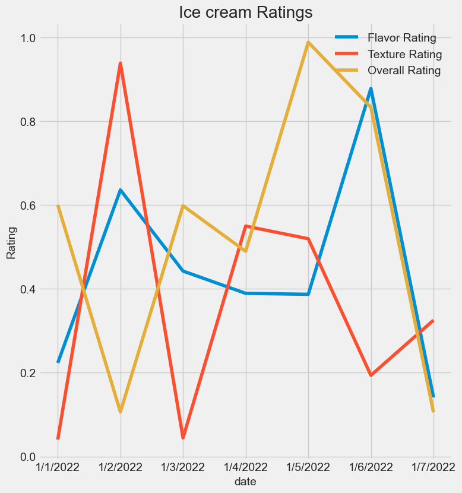
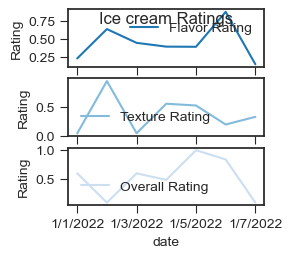
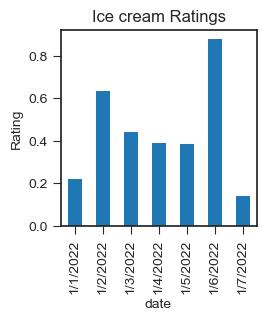
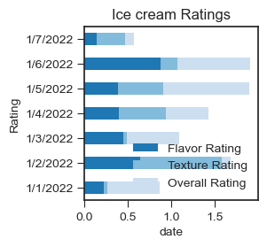
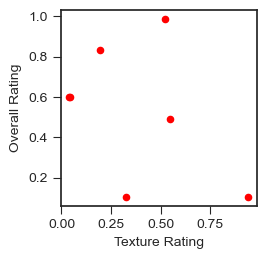
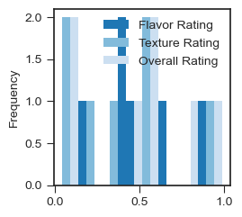
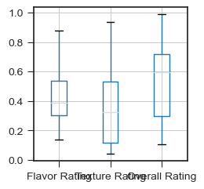
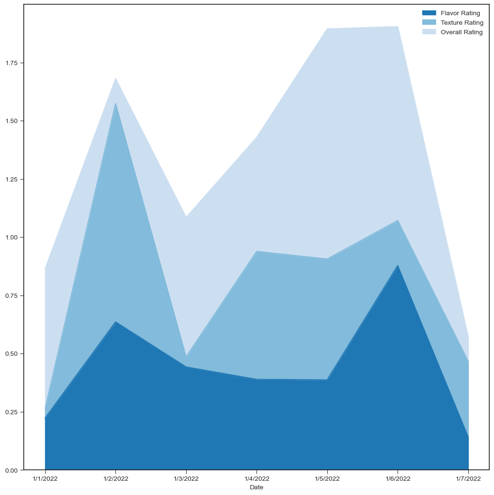
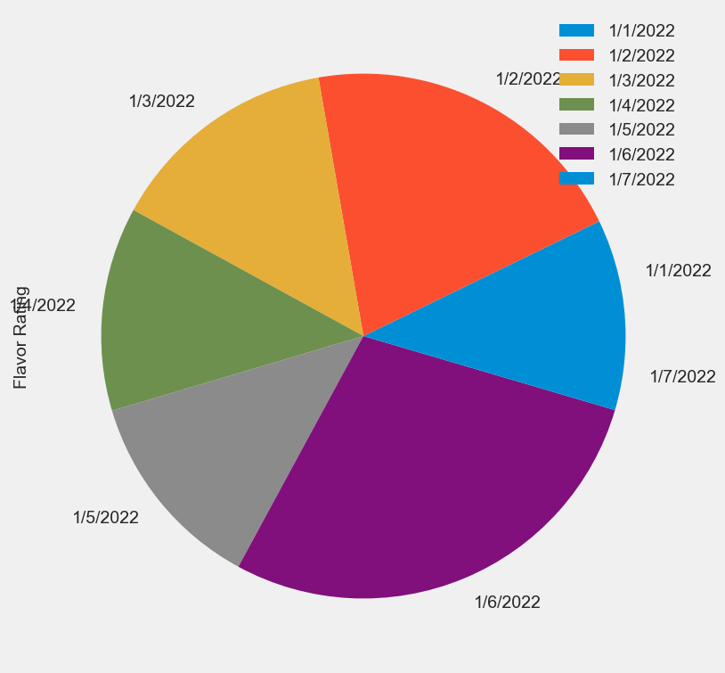

```python
import pandas as pd
import numpy as np
import matplotlib.pyplot as plt
```


```python
df = pd.read_csv("/Users/Sowmya/Downloads/Ice Cream Ratings.csv")
df = df.set_index("Date")
df
```


<div>
<style scoped>
    .dataframe tbody tr th:only-of-type {
        vertical-align: middle;
    }

    .dataframe tbody tr th {
        vertical-align: top;
    }

    .dataframe thead th {
        text-align: right;
    }
</style>
<table border="1" class="dataframe">
  <thead>
    <tr style="text-align: right;">
      <th></th>
      <th>Flavor Rating</th>
      <th>Texture Rating</th>
      <th>Overall Rating</th>
    </tr>
    <tr>
      <th>Date</th>
      <th></th>
      <th></th>
      <th></th>
    </tr>
  </thead>
  <tbody>
    <tr>
      <th>1/1/2022</th>
      <td>0.223090</td>
      <td>0.040220</td>
      <td>0.600129</td>
    </tr>
    <tr>
      <th>1/2/2022</th>
      <td>0.635886</td>
      <td>0.938476</td>
      <td>0.106264</td>
    </tr>
    <tr>
      <th>1/3/2022</th>
      <td>0.442323</td>
      <td>0.044154</td>
      <td>0.598112</td>
    </tr>
    <tr>
      <th>1/4/2022</th>
      <td>0.389128</td>
      <td>0.549676</td>
      <td>0.489353</td>
    </tr>
    <tr>
      <th>1/5/2022</th>
      <td>0.386887</td>
      <td>0.519439</td>
      <td>0.988280</td>
    </tr>
    <tr>
      <th>1/6/2022</th>
      <td>0.877984</td>
      <td>0.193588</td>
      <td>0.832827</td>
    </tr>
    <tr>
      <th>1/7/2022</th>
      <td>0.140995</td>
      <td>0.325110</td>
      <td>0.105147</td>
    </tr>
  </tbody>
</table>
</div>


```python
print(plt.style.available)
plt.style.use('fivethirtyeight')
```

    ['Solarize_Light2', '_classic_test_patch', '_mpl-gallery', '_mpl-gallery-nogrid', 'bmh', 'classic', 'dark_background', 'fast', 'fivethirtyeight', 'ggplot', 'grayscale', 'seaborn-v0_8', 'seaborn-v0_8-bright', 'seaborn-v0_8-colorblind', 'seaborn-v0_8-dark', 'seaborn-v0_8-dark-palette', 'seaborn-v0_8-darkgrid', 'seaborn-v0_8-deep', 'seaborn-v0_8-muted', 'seaborn-v0_8-notebook', 'seaborn-v0_8-paper', 'seaborn-v0_8-pastel', 'seaborn-v0_8-poster', 'seaborn-v0_8-talk', 'seaborn-v0_8-ticks', 'seaborn-v0_8-white', 'seaborn-v0_8-whitegrid', 'tableau-colorblind10']


```python
df.plot(kind = 'line', title = 'Ice cream Ratings', xlabel = 'date', ylabel = 'Rating', figsize = (8,8))
```


    <Axes: title={'center': 'Ice cream Ratings'}, xlabel='date', ylabel='Rating'>


    

    


```python
df.plot(kind = 'line', subplots = True, title = 'Ice cream Ratings', xlabel = 'date', ylabel = 'Rating')
```


    array([<Axes: xlabel='date', ylabel='Rating'>,
           <Axes: xlabel='date', ylabel='Rating'>,
           <Axes: xlabel='date', ylabel='Rating'>], dtype=object)


    

    


```python

```


```python
df['Flavor Rating'].plot(kind = 'bar',stacked = True, title = 'Ice cream Ratings', xlabel = 'date', ylabel = 'Rating')
```


    <Axes: title={'center': 'Ice cream Ratings'}, xlabel='date', ylabel='Rating'>


    

    


```python
df.plot.barh(stacked = True, title = 'Ice cream Ratings', xlabel = 'date', ylabel = 'Rating')
```


    <Axes: title={'center': 'Ice cream Ratings'}, xlabel='date', ylabel='Rating'>


    

    


```python
df.plot.scatter(x = 'Texture Rating', y = 'Overall Rating', c = 'red')
```


    <Axes: xlabel='Texture Rating', ylabel='Overall Rating'>


    

    


```python
df.plot.hist(bins = 20)
```


    <Axes: ylabel='Frequency'>


    

    


```python
df.boxplot()
```


    <Axes: >


    

    


```python
df.plot.area(figsize = (10,10))

```


    <Axes: xlabel='Date'>


    

    


```python
df.plot.pie(y = 'Flavor Rating', figsize = (10,8))

```


    <Axes: ylabel='Flavor Rating'>


    

    


```python

```
